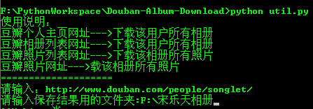
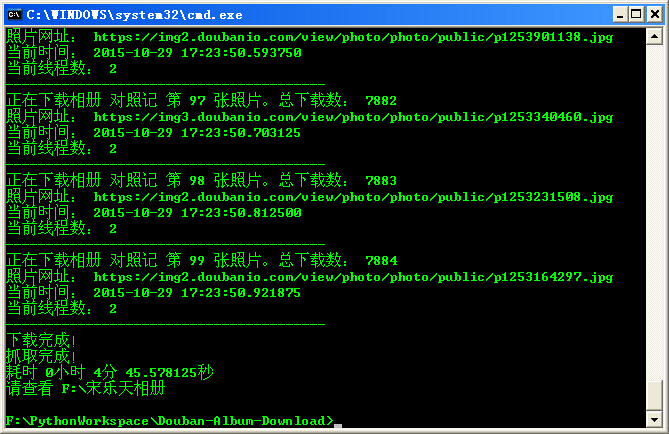
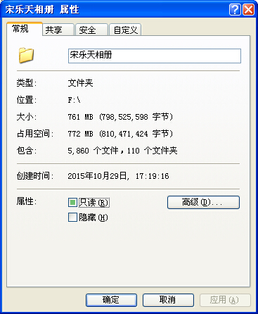

#批量下载豆瓣相册
------------

## 说明
程序入口是util.py。命令行执行，按提示输入相册列表页的网址和保存的文件夹

以[宋乐天相册]()为例：

开始下载：


下载完成：


文件夹大小：



## 注意
- Douban.sublime-workspace是Sublime Text 3 的workspac文件。与爬虫本身无关
- 豆瓣API请自行申请，然后写入同目录下的config.ini，格式如下：
```
[API]
apikey = xxxxxxxxxxxx
```


## Change log
2015.10.29：添加了最基本的多线程功能。
2015.10.27：刚完成单线程爬虫，已经可以使用。

## TODO
- 重构代码，分离下载、解析逻辑
- 把目前每个相册新开一个线程，改成线程池
- 添加选择相册再下载的功能
- 保存下载状态数据，用于意外崩溃后继续
- 添加logging模块，导出日志文件
- 添加GUI界面

暂时只想到这么些，慢慢加。

接下来要忙Android，会有段时间无法更新——2015年10月29日


## Author
Email:jwgmail@126.com

Blog : [http://blog.csdn.net/kinglearnjava](http://blog.csdn.net/kinglearnjava)
